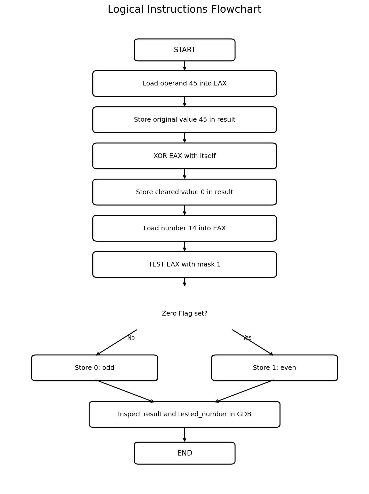

# Logical Instructions

## Objective

Demonstrate logical instructions in 32-bit Intel x86 Assembly language using NASM on Linux.

The program completes both required tasks:

1. XOR an operand with itself to change the operand to `0`.
2. Use the `TEST` instruction in a practical even-or-odd example.

## Flowchart



## XOR Instruction

The program loads `45` into `EAX` and stores the original value in `result`. It then performs:

```asm
xor eax, eax
```

XORing a register with itself clears every bit, so `EAX` becomes `0`. The program stores the new value in `result`.

```text
45 XOR 45 = 0
result = 0
```

This is a common way to clear a register.

## TEST Instruction

The practical example checks whether `14` is even or odd.

```asm
test eax, 1
```

The mask `1` checks the least significant bit:

- A least significant bit of `0` means the number is even.
- A least significant bit of `1` means the number is odd.

`TEST` performs a bitwise comparison and updates the processor flags, but it does not change the operand. After the instruction, `tested_number` still receives `14`.

The program uses:

```text
result = 1 for even
result = 0 for odd
```

Because `14` is even, the final value is:

```text
result = 1
tested_number = 14
```

## Challenges

The first challenge was demonstrating the change caused by XOR clearly in GDB. I stored the original value in `result` before XOR and then stored the cleared value afterward. This allows the watchpoint to show the change from `45` to `0`.

The second challenge was using `TEST` without accidentally changing the flags before the conditional jump. The `MOV` instruction used to save `EAX` does not alter the flags, so `JZ` can still use the Zero Flag set by `TEST`.

## Compile and Debug

```bash
nasm -f elf32 -g -F dwarf logical_instructions.asm
ld -m elf_i386 -o logical_instructions logical_instructions.o
gdb logical_instructions
```

Inside GDB:

```gdb
layout asm
layout regs
watch (int) result
break _start
run
stepi
```

Continue using `stepi` to observe `result` change from `45` to `0` and then to `1`.

To confirm that `TEST` did not alter the number:

```gdb
print (int) tested_number
```

The displayed value should be `14`.
